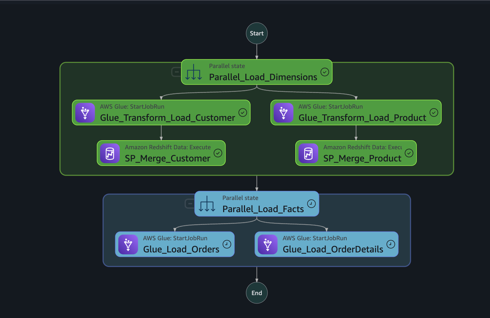
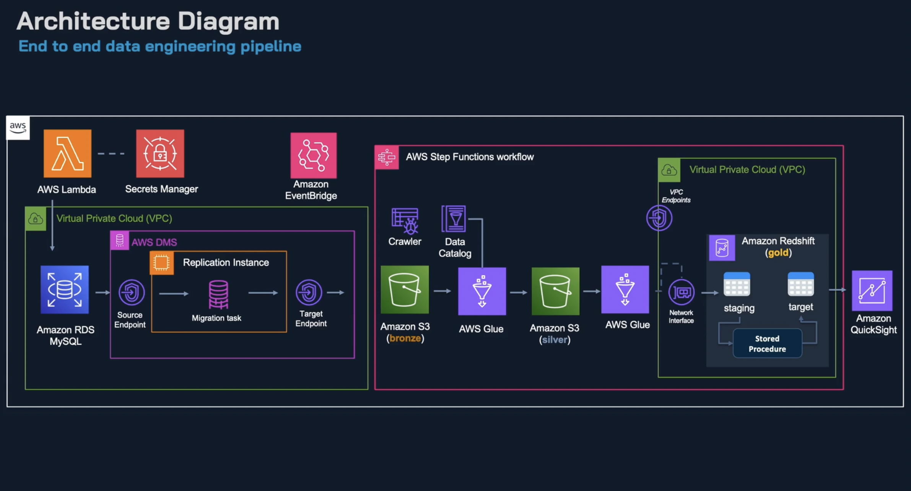
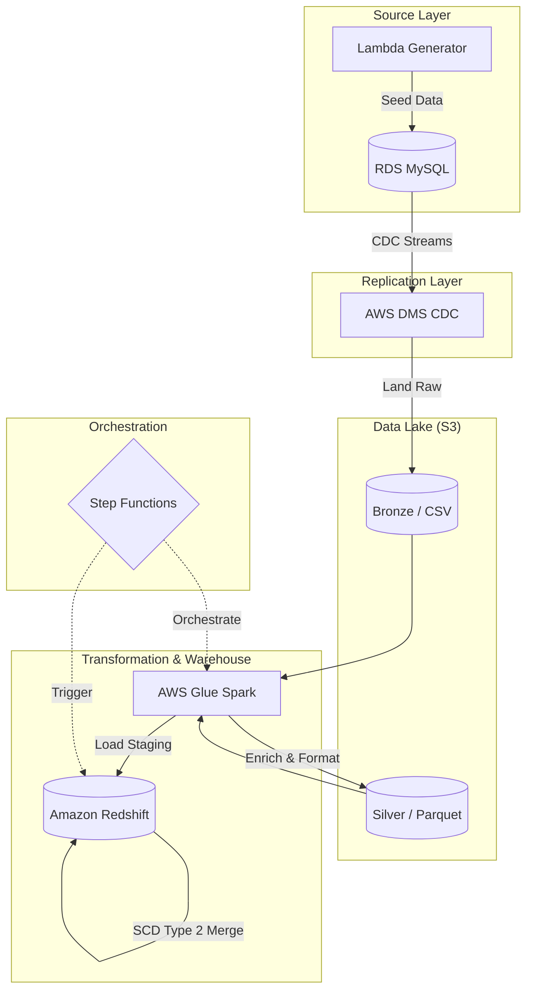

# End-to-End Data Engineering Project for AWS Data Engineer Associate

In this project, we create an end-to-end data engineering data pipeline ingesting, processing and loading sales data, and finally visualized in a quicksight dashboard.

> 📖 This project was tackled when preparing for the AWS Data Engineer Associate examp, check out [the course on Udemy](https://www.udemy.com/course/complete-aws-certified-data-engineer-end-to-end-project/).

We consider a startup company offering a range of clothing products like jewlery, accessories, bags etc
They have an application running on MySQL database on-premise, and an analyst querying data and performing an analysis in excel spreadsheets.

However, there start a challenge: as the startup scale, they needs more analytics, for marketing campaigns, and business strategy however the current database is not optimized for analytics.

We build the different services required from ingesting data in our bronze layer to exposing it into a dashboard in QuickSight (also explored Metabase and Apache Superset).


## Pre-requisites

Ideally you should be familiar with AWS, with some understand of networking, security etc.
You should create a free AWS account if you don't have one already.
Create an IAM user with admin access.
Think about the cost of the services used in this project (set up budget), and clean up resources after you finish.
You can use DBeaver or any SQL client to connect to the databases.

## Architecture Diagram



In the diagram above, we have simulated an on-premise MySQL database using RDS and Lambda (for data generation).
The actual data pipeline starts with DMS replicating data using CDC to Amazon S3 in csv format (this is the raw zone).
Then we use AWS Glue to process the data, into a silver layer and load it into Redshift (our data warehouse).
Finally, we use Quicksight to visualize the data.





Detailed logic for orchestration and security can be found in:
- [Security Design](./docs/SECURITY_DESIGN.md)
- [Operations Guide](./docs/OPERATIONS_GUIDE.md)

We will be using the following services:

- S3
- DMS
- RDS
- Redshift
- IAM
- Secrets Manager
- VPC
- CloudWatch
- Step Functions
- Lambda
- Glue
- Quicksight

## Project Structure

```text
.
├── Makefile                      <-- Control plane for post-provisioning tasks
├── application_db_rds            <-- Some DDL script the application database
├── data_generator_lambda         <-- Data generator simulating actual data from an e-commerce application
├── data_warehouse_redshift       <-- DDL scripts and procedures definition
│   ├── ddl
│   ├── stored_procedures
│   └── validation
├── db                            <-- Flyway migrations for RDS
├── docs
│   ├── architecture
│   ├── SECURITY_DESIGN.md
│   ├── OPERATIONS_GUIDE.md
│   └── NOTES.md
├── etl_glue_jobs                 <-- Actual transformation and loading jobs running on glue with spark
│   ├── load
│   └── transform
├── terraform                     <-- Infrastructure as Code
└── README.md
```

## TODO

* [x] Use UV for aws lambda packaging
* [x] Add notes on project steps
* [x] Automate initial setup with Terraform
* [ ] Clean AWS resources

## References

* [Complete AWS Certified Data Engineer](https://www.udemy.com/course/complete-aws-certified-data-engineer-end-to-end-project/)
* [AWS Skill Builder for DE](https://skillbuilder.aws/category/role/data-engineer)
* [Associate (DEA-C01) Exam Guide](https://d1.awsstatic.com/training-and-certification/docs-data-engineer-associate/AWS-Certified-Data-Engineer-Associate_Exam-Guide.pdf)
* [AWS Certified Data Engineer Cheatsheet](https://mydataengineering.com/posts/AWSDataEngineerCert/)
* [Laura Galera's note](https://github.com/lauragalera/aws-data-engineer-associate-notes?tab=readme-ov-file)
* [AWS Questions from Deepak's Wiki](https://deepaksood619.github.io/courses/aws-certified-data-engineer-associate-questions#question-2)
