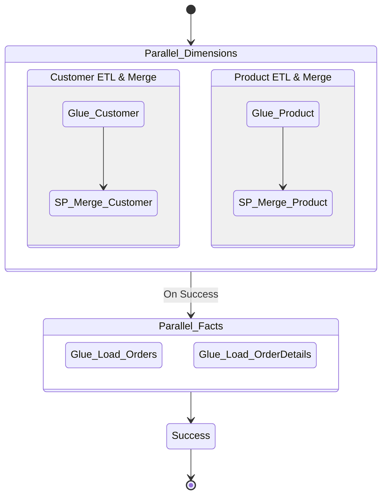

# Operations and Logic Guide

This document explains the functional logic and orchestration flow of the data pipeline for operators and maintainers.

## 1. Step Functions Orchestration

We use a sequential state machine to ensure data integrity and respect referential dependencies.

### 1.1. Parallel Dimensions
The state machine first processes the `Customer` and `Product` tables in parallel. This is because these are **Dimension Tables** that contain the "Source of Truth" for attributes used by Fact tables.

### 1.2. Sequential/Parallel Facts
Once dimensions are merged and the surrogate keys are stable, the state machine triggers the `Orders` and `OrderDetails` loads.

## 2. Incremental Loading (SCD Type 2)

We implement **Slowly Changing Dimensions (SCD) Type 2** to maintain a full history of changes in the warehouse.

### 2.1. The Merge Sequence
The following sequence is executed within the Redshift Stored Procedures:

1.  **Stage**: Glue loads raw data into a `stage_` table.
2.  **Expire**: Existing records in the `Gold` table that have been updated in the `Stage` (detected by `hash_value` mismatch) are expired by setting `active_flag = 0` and `record_end_ts = current_ts`.
3.  **Insert**: New records (or new versions of updated records) are inserted into the `Gold` table with `active_flag = 1`.
4.  **Clean**: The `Stage` table is truncated.

## 3. Glue Job State Management

To prevent duplicate data processing, we utilize two mechanisms:
- **Job Bookmarks**: Enabled on all Glue Spark jobs to track the last file processed in S3.
- **CDC Operations**: Our DMS task includes the `Op` column (I, U, D) which allows our Redshift procedures to distinguish between new inserts and updates.

## 4. Troubleshooting

- **SFN Failures**: Check the `Execution History` for the specific Glue job ID.
- **Concurrency Errors**: We have set `max_concurrent_runs = 5` to allow the parallel branches of the state machine to run without contention.
- **Schema Errors**: If a Glue job fails with "Column not found," re-run the Glue Crawlers to refresh the Data Catalog with the latest DMS headers.
