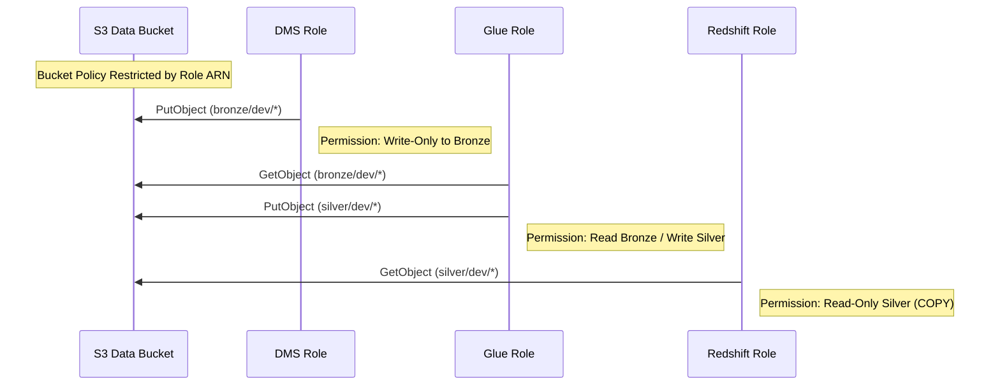

# Security and Policy Design

This document details the **Least Privilege** security model implemented for the AWS Data Engineering project. Every service is restricted to the surgical minimum set of permissions required for its function.

## 1. S3 Surgical Access Model

The primary data bucket is protected by an **S3 Bucket Policy** that explicitly denies access to all identities except for the specific IAM Roles used by our ETL services.

## 2. IAM Role Breakdown

### 2.1. DMS Replication Role
- **Access**: 
    - `secretsmanager:GetSecretValue`: To retrieve RDS credentials.
    - `s3:PutObject`: To land raw CSV files in `s3://bucket/bronze/`.
- **Nuance**: We implemented **Regional Service Principals** (`dms.ca-central-1.amazonaws.com`) in the trust policy to allow the regional workers to assume the role correctly.

### 2.2. Glue ETL Role
- **Access**:
    - `s3:GetObject`: From `bronze/`.
    - `s3:PutObject`: To `silver/`.
    - `redshift-data:*`: To execute bulk COPY commands and status checks via the Data API.
- **Service Policy**: Attached `AWSGlueServiceRole` for managed logging and catalog access.

### 2.3. Redshift RA3 Role
- **Access**:
    - `s3:GetObject`: From `silver/` prefix only.
- **Trust Policy**: Allows the Redshift service (`redshift.amazonaws.com`) to assume the role for S3 integration.

### 2.4. Lambda Generator Role
- **Access**:
    - `secretsmanager:GetSecretValue`: For RDS credentials.
    - `ec2:CreateNetworkInterface`: To execute within the private VPC.

## 3. Data API Authorization

To allow the **Step Functions Orchestrator** to trigger Redshift Stored Procedures without manual passwords, we granted:
- `redshift:GetClusterCredentials`
- `redshift-data:ExecuteStatement`

This enables **IAM-based authentication** for the entire control plane, removing the need to manage database users for orchestration logic.
