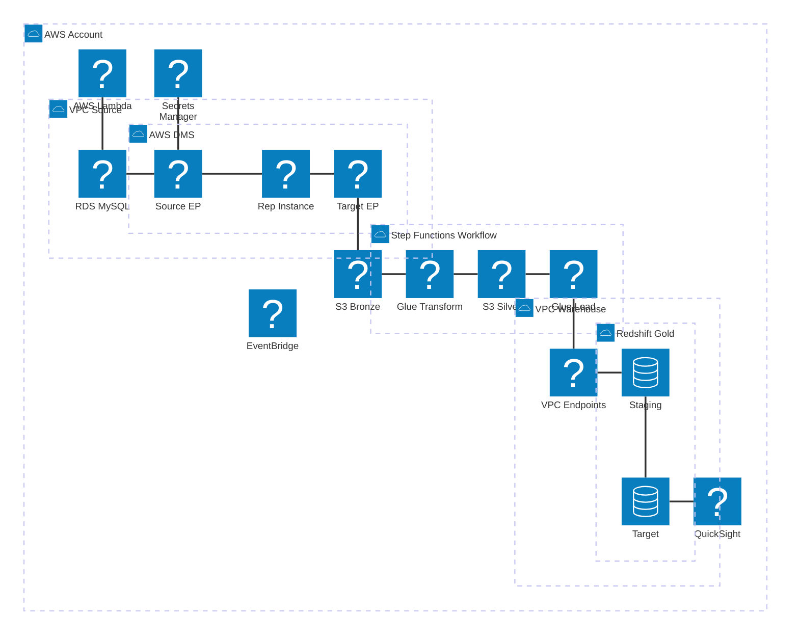

```mermaid
architecture-beta
    group aws_account(cloud)[AWS Account]
    service lambda(logos:aws-lambda)[AWS Lambda] in aws_account
    service sm(logos:aws-secrets-manager)[Secrets Manager] in aws_account
    service eb(logos:aws-eventbridge)[EventBridge] in aws_account
    group vpc_source(cloud)[VPC Source] in aws_account
    service rds(logos:aws-rds)[RDS MySQL] in vpc_source
    group dms_group(cloud)[AWS DMS] in vpc_source
    service source_ep(logos:aws-transfer-family)[Source EP] in dms_group
    service rep_inst(logos:aws-database-migration-service)[Rep Instance] in dms_group
    service target_ep(logos:aws-transfer-family)[Target EP] in dms_group
    service s3_bronze(logos:aws-s3)[S3 Bronze] in aws_account
    service s3_silver(logos:aws-s3)[S3 Silver] in aws_account
    group sfn_workflow(cloud)[Step Functions Workflow] in aws_account
    service glue_transform(logos:aws-glue)[Glue Transform] in sfn_workflow
    service glue_load(logos:aws-glue)[Glue Load] in sfn_workflow
    group vpc_wh(cloud)[VPC Warehouse] in aws_account
    service vpce(logos:aws-privatelink)[VPC Endpoints] in vpc_wh
    group redshift_group(cloud)[Redshift Gold] in vpc_wh
    service rs_staging(database)[Staging] in redshift_group
    service rs_target(database)[Target] in redshift_group
    service qs(logos:aws-quicksight)[QuickSight] in aws_account
    lambda:B -- T:rds
    sm:B -- T:source_ep
    rds:R -- L:source_ep
    source_ep:R -- L:rep_inst
    rep_inst:R -- L:target_ep
    target_ep:B -- T:s3_bronze
    s3_bronze:R -- L:glue_transform
    glue_transform:R -- L:s3_silver
    s3_silver:R -- L:glue_load
    glue_load:B -- T:vpce
    vpce:R -- L:rs_staging
    rs_staging:B -- T:rs_target
    rs_target:R -- L:qs
```